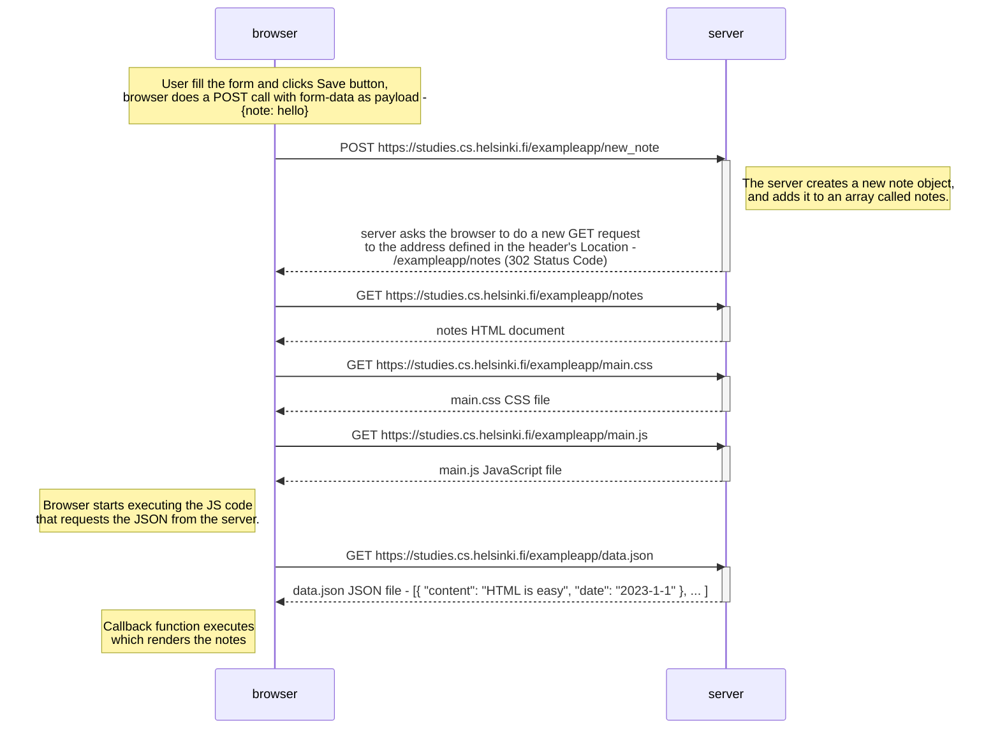

```mermaid
sequenceDiagram

    participant browser
    participant server

    Note over browser: User fill the form and clicks Save button, <br/> browser does a POST call with form-data as payload - <br/> {note: hello}

    browser->>server: POST https://studies.cs.helsinki.fi/exampleapp/new_note
    activate server

    Note right of server: The server creates a new note object,<br/> and adds it to an array called notes.

    server-->>browser:  server asks the browser to do a new GET request<br/> to the address defined in the header's Location - <br/> /exampleapp/notes (302 Status Code)
    deactivate server

    browser->>server: GET https://studies.cs.helsinki.fi/exampleapp/notes
    activate server
    server-->>browser: notes HTML document
    deactivate server

    browser->>server: GET https://studies.cs.helsinki.fi/exampleapp/main.css
    activate server
    server-->>browser: main.css CSS file
    deactivate server

    browser->>server: GET https://studies.cs.helsinki.fi/exampleapp/main.js
    activate server
    server-->>browser: main.js JavaScript file
    deactivate server

    Note left of browser: Browser starts executing the JS code <br/> that requests the JSON from the server.

    browser->>server: GET https://studies.cs.helsinki.fi/exampleapp/data.json
    activate server
    server-->>browser: data.json JSON file - [{ "content": "HTML is easy", "date": "2023-1-1" }, ... ]
    deactivate server

    Note left of browser: Callback function executes <br/> which renders the notes

```
