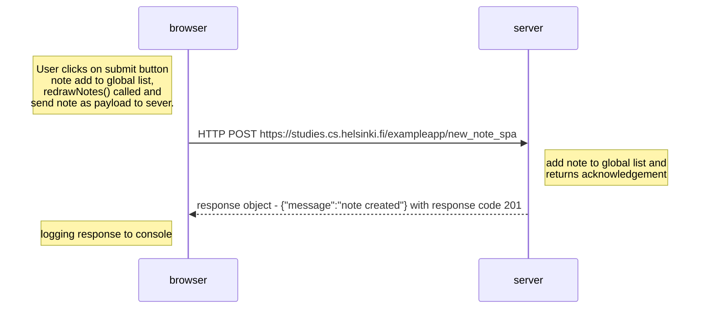

```mermaid
sequenceDiagram
    participant browser
    participant server

    Note left of browser: User clicks on submit button <br/> note add to global list,<br/> redrawNotes() called and<br/> send note as payload to sever.

    browser->>server: HTTP POST https://studies.cs.helsinki.fi/exampleapp/new_note_spa

    Note right of server: add note to global list and <br/>returns acknowledgement

    server-->>browser: response object - {"message":"note created"} with response code 201

    Note left of browser: logging response to console
```
